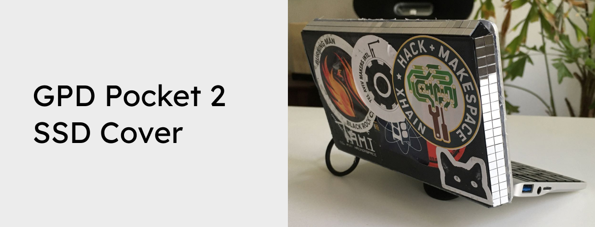

Did you install macOS on an external SSD to turn your GPD Pocket 2 into a Hackintosh? Awesome! Now let's 3D print a cover for your external SSD, so you have your SSD always fixed to your laptop.

Want to support the development and stay updated?

 

## Instrutions
3D print the .stl file if you use the SanDisk Extreme Portable SSD - or adapt the 3D model first on Tinkercard ([https://www.tinkercad.com/things/aNIFQy44Yg2](https://www.tinkercad.com/things/aNIFQy44Yg2)). Then place the SSD and USB connecting cable inside - and make sure you use a durable angled USB cable to connect the SSD to the GPD Pocket 2. Otherwise you might end up with a lot of kernel panics, caused by the unreliable connection of a cheap USB cable.